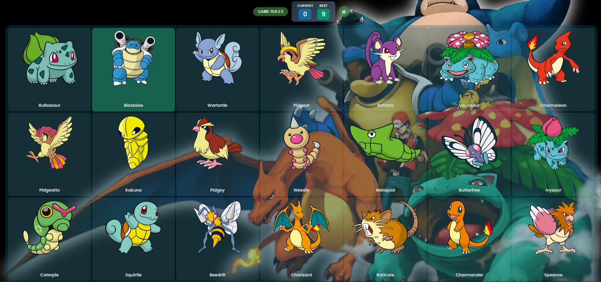

# 🎮 Pokémon Memory Game

Interactive memory game with Pokémon cards. Test your memory by clicking cards without repeating any. Each successful click shuffles the cards and increases the difficulty!



## 🚀 Demo

🔗 [Play Live](https://statuesque-capybara-b6c91d.netlify.app/)

---

## ✨ Features

- 🃏 **21 unique cards** with real Pokémon from PokeAPI
- 🎵 **Sound effects** for hits and misses (optional)
- 🎊 **Confetti animation** when you beat your record
- 📱 **Responsive design** for mobile and desktop
- 🎨 **Modern interface** with gradients and animations

---

## 🛠️ Technologies

- **[React 18](https://react.dev/)** - UI library
- **[Vite](https://vitejs.dev/)** - Build tool and dev server
- **[PokeAPI](https://pokeapi.co/)** - Pokémon data
- **[react-confetti](https://www.npmjs.com/package/react-confetti)** - Celebration effects
- **[ESLint](https://eslint.org/)** - Linting with React rules

---

## 📋 Prerequisites

- Node.js 18+ (recommended: 20 LTS)
- npm 9+ or yarn 1.22+

> 💡 Use [nvm](https://github.com/nvm-sh/nvm) to manage Node versions. The project includes a `.nvmrc` file.

---

## 🚀 Local Installation

```bash
# Clone the repository
git clone https://github.com/your-username/pokemon-card-game.git
cd pokemon-card-game

# Use the correct Node version (if you have nvm)
nvm use

# Install dependencies
npm install

# Start development server
npm run dev
```

The application will be available at `http://localhost:5173`

---

## 🎯 How to Play

1. **21 cards** with random Pokémon are displayed
2. Click a card to earn **+1 point**
3. **Watch out!** Cards **shuffle automatically** after each click
4. **Don't repeat** any card or you'll lose and reset to 0 points
5. Try to reach the maximum score: **21 points**
6. Your **best score** is saved between sessions

### Additional Controls

- 🔊 **Sound Button**: Toggle sound effects on/off
- 📖 **Rules**: Show/hide game instructions

---

## 📝 Available Scripts

| Command           | Description                         |
| ----------------- | ----------------------------------- |
| `npm run dev`     | Start development server with HMR   |
| `npm run build`   | Generate optimized production build |
| `npm run preview` | Preview production build locally    |
| `npm run lint`    | Run ESLint to find code issues      |

---

## 📁 Project Structure

```
pokemon-card-game/
├── public/
│   ├── sounds/           # Sound effects (win.wav, lose.wav)
│   └── vite.svg
├── src/
│   ├── api/
│   │   └── pokemonApi.jsx    # PokeAPI calls
│   ├── assets/
│   │   └── images/
│   │       └── background.jpg
│   ├── components/
│   │   ├── Card.jsx          # Individual card component
│   │   ├── GameBoard.jsx     # Main board and game logic
│   │   ├── GameRulesModal.jsx # Rules modal
│   │   ├── ScoreBoard.jsx    # Score display
│   │   └── SoundButton.jsx   # Sound toggle button
│   ├── hooks/
│   │   └── useGame.js        # Custom hook for game logic
│   ├── utils/
│   │   └── shuffle.js        # Shuffle utility function
│   ├── styles/
│   │   └── styles.css        # Global styles
│   ├── App.jsx               # Main app component
│   └── main.jsx              # Entry point
├── index.html
├── package.json
├── vite.config.js
└── .eslintrc.cjs
```

---

## 🐛 Known Issues

- Sound effects may not play on mobile Safari until the first user interaction (autoplay policy)
- Confetti may cause lag on low-end devices

---

## 🔮 Future Improvements

- [ ] Different difficulty levels (fewer/more cards)
- [ ] Time attack mode
- [ ] Global leaderboard
- [ ] Unit tests with Vitest
- [ ] Dark/light mode

---

## 🤝 Contributing

1. Fork the project
2. Create a feature branch (`git checkout -b feature/new-feature`)
3. Commit your changes (`git commit -m 'Add: new feature'`)
4. Push to the branch (`git push origin feature/new-feature`)
5. Open a Pull Request

---

## 📄 License

Distributed under the MIT License. See `LICENSE` for more information.

---

## 🙏 Acknowledgments

- Pokémon data provided by [PokeAPI](https://pokeapi.co/)
- [Poppins](https://fonts.google.com/specimen/Poppins) font from Google Fonts

---

<p align="center">Made with ❤️ and React</p>
